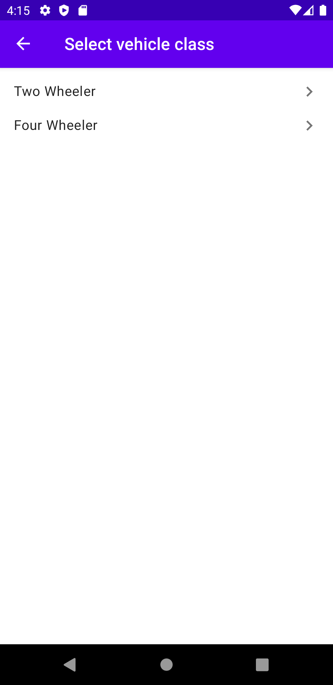

# Vehicle Profiling
An Android app which to create vehicle profiles and save them locally in a db on device storage.

Made for TurboCare test Assignment as per this [guide](https://docs.google.com/document/d/1-pziB-_kwkbDISvTQgz1Bu1FEDYIVPexeGbha_2x69Q/edit).

### Showcased Skillset - 
The App showcases following features and skillsets: - 

1. Complete App is Developed in Kotlin
2. Follows the MVVM (Model-View-ViewModel) design pattern.
3. Custom miniature implementation of Dependency Injection using a Singleton Class
4. Single Activity Application using Navigation Components.
5. Abstraction in Repositories and DataSources as much as possible
6. Aim to write as clean code as possible.
6. Local and Remote Data Sources For Caching and Network requests.
7. Room is used as a Local DataSource.
8. Retrofit is used as the Remote DataSource Client
9. Use of Coroutines as much as possible.
10. Use of Generics and Base classes to reduce redundant code. For eg. use of a single Generic RecyclerView Adapter for all screens, instead of making one for each.
11. Use of ViewBinding.

### Jetpack Components used as follows :- 
1. Room Database
2. ViewModel and LiveData
3. NavigationUI (NavController and Navigation Graphs) and Safe-Args
4. Basic UI components like Constraint Layout, etc using androidX

### Possible Future Updates
1. Add progress bars and success prompts for better UX.
2. Add Caching for Make and Model retrieval. (Provision is there, but yet to implementated)
3. Better theming and Animations
4. Add new App launcher Icon
5. Add Input validations.

### Screenshots

